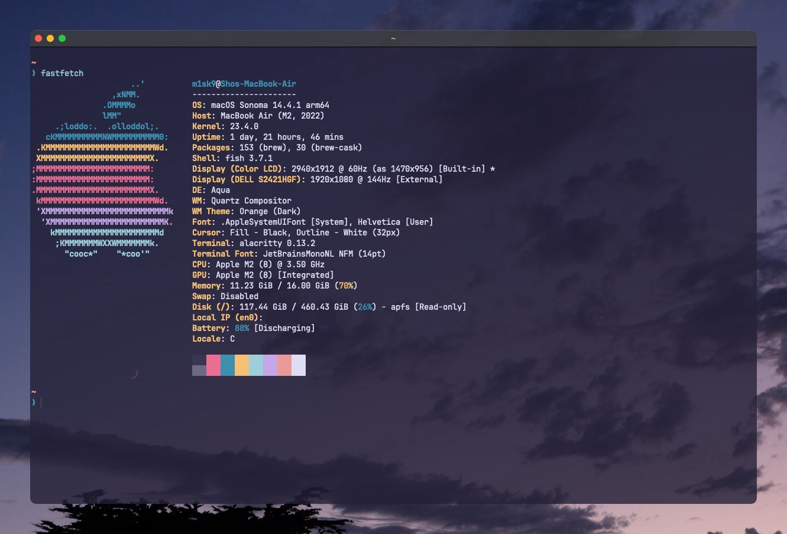

# dotfiles

m1sk9's dotfiles.

## System information

**MacBook Air (M2, 2022)**

- **OS**: macOS Sonoma 14.4.1 (23.4.0)
- **CPU**: Apple M2
- **Memory**: 16GB
- **Disk**: 512GB (SSD)

## Features

- **Editor & IDE**: [Visual Studio Code](https://code.visualstudio.com/), [zed](https://zed.dev/), [JetBrains IDE](https://www.jetbrains.com/)
- **Termial**: [Alacritty](https://alacritty.org/)
- **Shell**: [fish](https://fishshell.com/)
