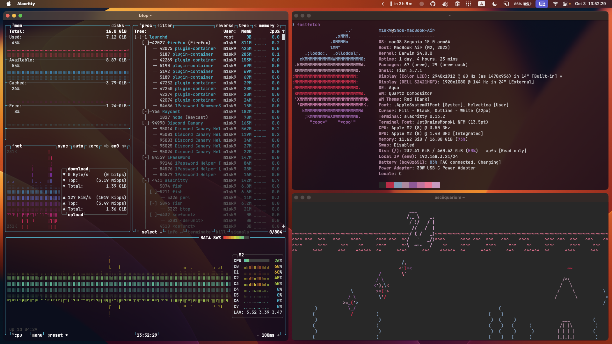

# m1sk9/dotfiles



```sh
chezmoi init git@github.com:m1sk9/dotfiles.git
chezmoi apply
```

## Using

- Browser: Mozilla Firefox Nightly
- Window Manager: yabai + skhd
- Email Client: Mozilla Thunderbird Daily
- Terminal: Alacritty
- Shell: Fish
- Editor: Visual Studio Code, NeoVim
- IDE: JetBrains IDE
- Device:
    - Laptop (Primary): MacBook Air M2 2022 (macOS Sonoma, 13.6-inch, 16GB RAM, 512GB SSD)
    - Laptop (Secondary): MacBook Air M1 2020 (macOS Monterey, 13.3-inch, 8GB RAM, 256GB SSD)
    - Desktop: self-created (Windows 11, Ryzen 5 5600X + GTX 1660 Super, 16GB RAM)
